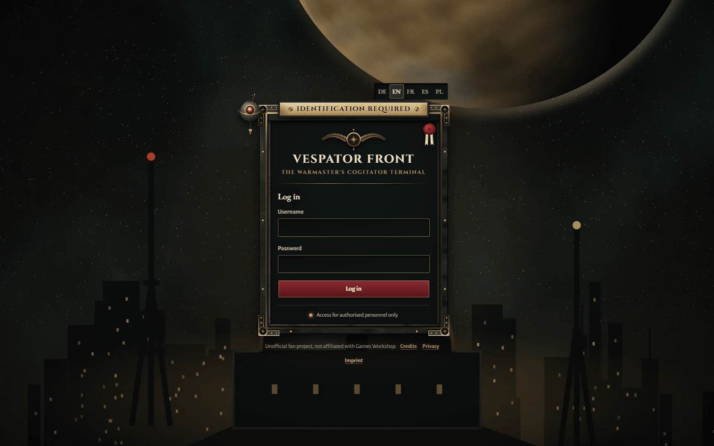
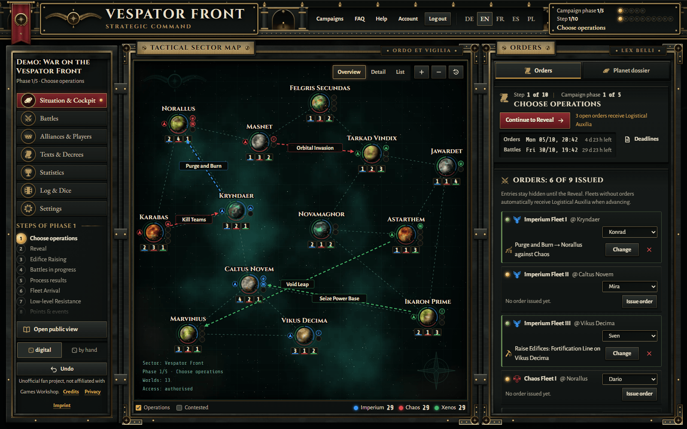
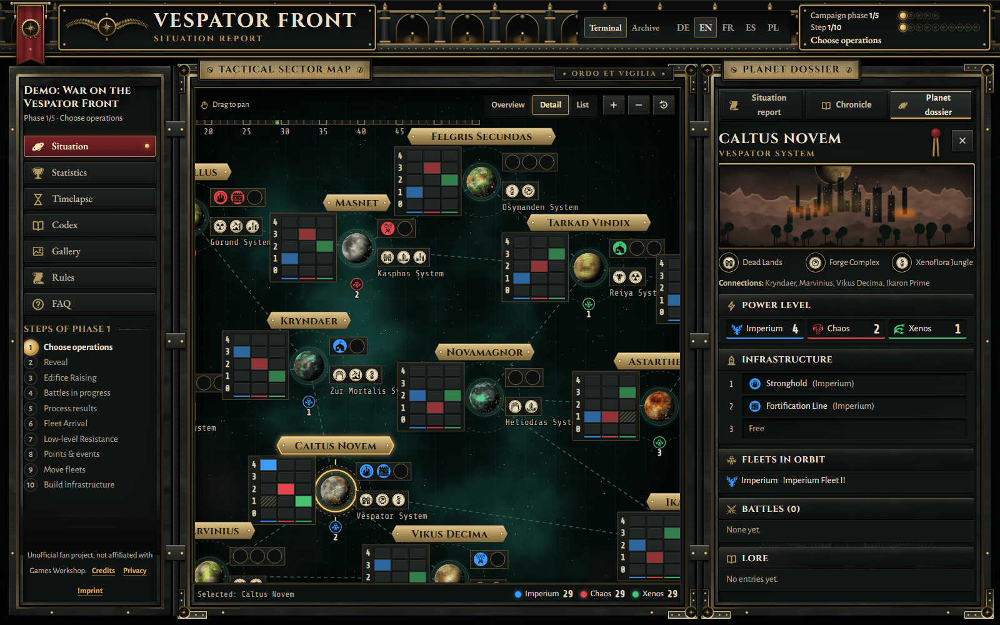
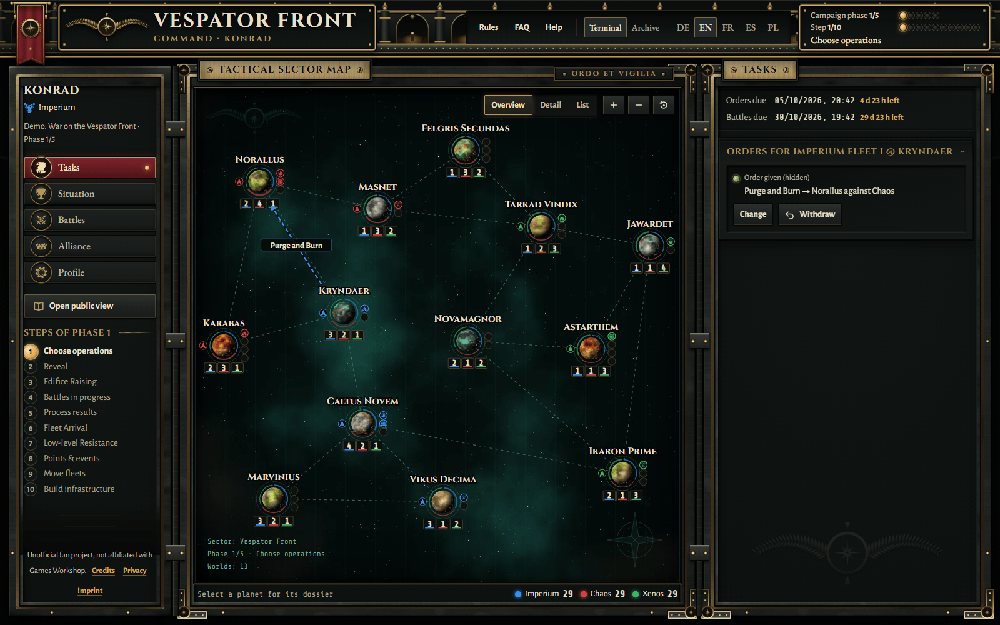
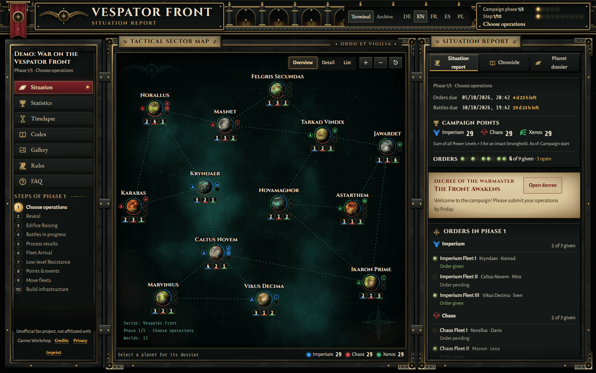
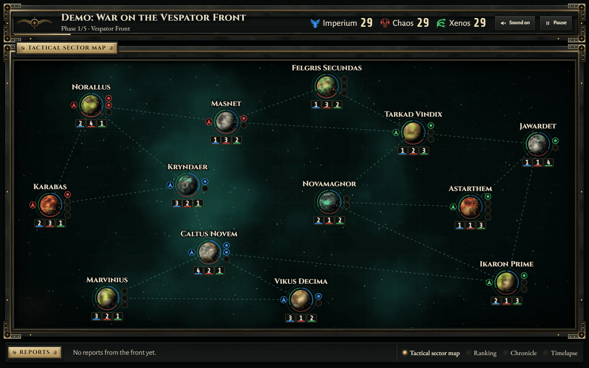
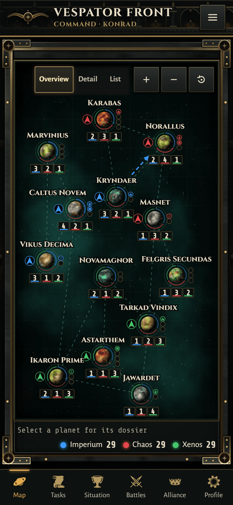

# Vespator Front Campaign Manager

Deutsche Fassung: [README.de.md](README.de.md)

A self-hosted web app for running a Warhammer 40,000 (10th edition) map campaign under the "War on the Vespator Front" rules from *500 Worlds: Titus*. It is written for clubs and gaming groups. One Warmaster (game master) runs the campaign, players take part through personal links, and anyone else can follow the war in a read-only view. The app works out the campaign consequences, keeps score and records the history of the campaign.

> **Unofficial fan project; not affiliated with or endorsed by Games Workshop.** Warhammer 40,000 and related marks are property of their respective owners. You need the book *500 Worlds: Titus* to play; the app contains no rules text. It only knows names and mechanics and refers to the book.

## Contents

- [Features](#features)
- [How a campaign flows](#how-a-campaign-flows)
- [Screenshots](#screenshots)
- [Quick start (development)](#quick-start-development)
- [Deployment](#deployment)
- [Configuration](#configuration)
- [Languages](#languages)
- [Architecture](#architecture)
- [Tests and CI](#tests-and-ci)
- [Contributing](#contributing)
- [License and credits](#license-and-credits)
- [Further documentation](#further-documentation)

## Features

### Warmaster (game master)

- Accounts with two roles: admin (owns the instance) and co-Warmaster (invited, sees only the campaigns shared with them). Every log entry names its author.
- Campaigns with 2 or 3 alliances. A setup wizard walks you through the start, and the phase cockpit shows the next step and what is still open.
- Operations, battles (1v1 and multiplayer), events, medals and outcomes. The app calculates the consequences. You can override any value if you give a reason, and undo any action (full revision history with snapshots per phase).
- Dice: digital or manual, with a public dice log.
- House rules: the interpretations from the [rules FAQ](docs/FAQ.en.md) and other options (mission pool, hidden score, alternative final scoring, reserve fleets, custom battle sizes and editions, ...) can be switched on per campaign. By default the app follows the book.
- Map editor and map generator, your own planet images, campaign templates, a scenario sandbox.
- Texts: a decree builder that works from prepared text blocks, briefings, a gallery, bilingual content fields.
- Print sheets (orders, movement, results with QR code), QR cards for player links, exports (JSON, ZIP with images, map PNG, phase report), and automatic daily backups with restore.
- Club calendar with tables and a collision check, a league across campaigns with a Hall of Fame, basic Crusade integration, a health page and privacy tools.

### Players (personal link, no account)

- Every player gets a secret link (`/p/<token>`), for example as a printed QR card.
- Players give fleet orders (only the commander of a fleet can), and move fleets and build infrastructure when it is their turn.
- They report battle results with photos, and the opponent confirms or disputes them. Dates for games are proposed and accepted on the same page.
- Profile: nickname, army, avatar, a commander with honours and scars, notification settings, absence per phase.
- An iCal subscription for their own battles.

### Viewers (read-only link)

- The reader view (`/v/<token>`) needs no account. It has the interactive map, scores, battle feed, statistics, time-lapse, the Codex (a printable campaign chronicle), gallery, briefings, rules page and rules FAQ.

### Presentation mode

- A full-screen view for club evenings (`/v/<token>/present`) that rotates through the map, battles and a ticker. The interval is adjustable, and the browser can generate optional ambient sound.

### Notifications

- E-mail via SMTP (TLS enforced), with unsubscribe links.
- Web push in the browser (keys are created automatically), per player link and category.
- Discord: a webhook per campaign, plus an optional Discord bot with slash commands (status, scheduling, confirming results).
- iCal feeds for players and for the club calendar.
- Deadline reminders, and one-time links that confirm a result without opening the player page.

## How a campaign flows

1. Create a campaign (optionally from a template or as a follow-up campaign) and choose alliances, house rules and the number of phases.
2. Setup wizard: alliances and players → assign medals → strongholds and power level → starting infrastructure → fleet starting positions → prepare the start.
3. Each phase runs in steps: 1 choose operations (players give orders) → 2.1 reveal → 2.2 edifice raising → 2.3 battles (scheduled and played at the table, results reported and confirmed) → 2.4 process results → 2.5 fleet arrival → 2.6 low-level resistance → 3 scores and events → 4 move fleets → 5 build infrastructure.
4. The Warmaster advances step by step, and the cockpit warns about open orders and unconfirmed results. Reader view, player pages and notifications update on their own.
5. After the last phase the final scoring decides the winner, and a tie leads to a deciding battle. The finished campaign stays readable (Codex, time-lapse) and can seed a follow-up campaign with the same players, alliances and medals.

The [user guide](docs/GUIDE.md) explains each step in detail.

## Screenshots

The screenshots show synthetic demo data only.



*Login and first-run setup*



*The Warmaster's cockpit during a phase*



*Interactive campaign map*



*A player's page, opened through the personal link*



*Read-only view for everyone*



*Presentation mode for club evenings*



*Mobile layout*

## Quick start (development)

Requirements: Node.js 24.21 or a newer 24.x (for `node:sqlite` and `crypto.argon2`), npm, and network access during the build (fonts are loaded through `next/font/google`).

```bash
npm ci
npm run dev
```

1. Open http://localhost:3000.
2. Setup token: while no account exists, the server prints a one-time token to its console on every start:
   `[Ersteinrichtung] Einmal-Token: … – http://localhost:3000/setup-admin?token=…`
   Open that link and create the admin account. You can also set your own token with `SETUP_TOKEN=<at least 16 characters>` before starting.
3. Data is stored in `./data` (SQLite) and `./uploads`.

Optional: `npm run seed:demo` creates a demo campaign (3 alliances, 9 players, phase 1) and prints its admin and public link.

## Deployment

The app runs as a Docker image behind [Caddy](https://caddyserver.com/), which fetches HTTPS certificates on its own:

```bash
cp .env.example .env    # set DOMAIN
docker compose up -d --build
docker compose logs app | grep Ersteinrichtung   # one-time setup link
```

[DEPLOY.md](DEPLOY.md) (German) covers volumes, backups and restore, notifications, sessions, hardening and updates.

## Configuration

[.env.example](.env.example) documents all runtime settings. The main ones:

| Variable | Purpose |
| --- | --- |
| `DOMAIN` | Domain for Caddy and HTTPS (Docker) |
| `APP_URL` | Public base URL for links in e-mails, push and Discord messages |
| `SETUP_TOKEN` | Optional fixed one-time token for creating the first account |
| `INSECURE_COOKIES` | `1` only for local tests over plain HTTP; never on the internet |
| `TRUST_PROXY` | `1` = read the client IP from proxy headers (only behind your own reverse proxy) |
| `TZ` | Time zone; also sets when the daily backups run |
| `DATA_DIR`, `UPLOAD_DIR`, `BACKUP_DIR` | Storage locations for the database, images and backups |
| `UPLOAD_QUOTA_MB` | Image storage per campaign (default 200) |
| `SMTP_HOST`, `SMTP_PORT`, `SMTP_USER`, `SMTP_PASS`, `SMTP_FROM` | E-mail; can also be set in the app under *Account* |
| `DISABLE_SCHEDULER` | `1` = switch off background jobs (outbox, reminders, backups) |
| `NEXT_PUBLIC_FLAVOR` | Build time: `neutral` (default) or `imperial` look of drawn motifs |
| `NEXT_PUBLIC_DEFAULT_LOCALE` | Build time: default language `de`, `en` (default), `fr`, `es` or `pl`; the default language chosen at first setup takes precedence |

Discord webhooks, the Discord bot and web push are configured in the app (*Account → Services* and the campaign settings), not through environment variables.

## Languages

The interface is available in German, English, French, Spanish and Polish, and each account, player and reader can pick a language. German is the source language; French, Spanish and Polish fall back to English where a text is missing. Game terms from the book stay in English in every language. The rules FAQ and the user guide exist in German and English.

If nothing else sets the language (language switch, account, player or campaign language, the default language chosen at first setup, the browser language), the app uses the build default `NEXT_PUBLIC_DEFAULT_LOCALE`, which is English unless set. For a German installation, build with `NEXT_PUBLIC_DEFAULT_LOCALE=de`.

## Architecture

```text
src/engine/   rules engine: pure and deterministic; every change is a command → new state + log
     │        (executeCommand, warnings, overrides, dice), no I/O
     ▼
src/server/   node:sqlite storage, revisions/undo, auth and roles, uploads, notifications,
     │        backups, scheduler, projections for readers and players
     ▼
src/app/      Next.js App Router UI: /admin (Warmaster), /v/<token> (reader view),
src/components/  /p/<token> (player pages), /hall, /liga, API routes
```

- The engine holds the campaign state and applies commands. Each command is validated against a zod schema, may raise warnings that need a reason, and writes a log entry. The engine does no I/O and is fully unit-tested.
- Everything specific to the Vespator campaign sits behind the module interface `CampaignModule` in `src/engine/modules/`, so other campaign systems can be added. See [docs/MODULE.md](docs/MODULE.md).
- The server part consists of Next.js server actions and routes. Each campaign is stored as a sequence of revisions in SQLite (`node:sqlite`, file `data/app.db`), and undo means going back one revision. Uploaded images live in `uploads/`, daily backups in `data/backups/` (14 are kept).
- The UI uses React server and client components with Tailwind CSS. It can be installed as a PWA (read-only when offline).
- The security model in short:
  - Accounts (admin, co-Warmaster) log in with a password (Argon2); sessions are server-side cookies.
  - Players and readers use capability links: secret tokens in the URL (`/p/…`, `/v/…`), plus signed one-time, calendar and unsubscribe links. Anyone with a link has exactly its rights, so treat links like passwords. They can be regenerated.
  - Every entry point goes through one central authorization module (`src/server/authz.ts`). Readers and players only receive allow-listed projections of the campaign state, which never contain the hidden orders of other alliances.
  - The app sets a Content Security Policy with nonces, rate-limits logins and checks uploads. See [SECURITY.md](SECURITY.md) for reporting vulnerabilities and [DEPLOY.md](DEPLOY.md) for hardening.

| Path | Content |
| --- | --- |
| `src/engine/` | Rules engine and campaign modules |
| `src/server/` | SQLite, auth, revisions/undo, uploads, notifications, backups, export |
| `src/app/`, `src/components/` | Next.js pages and React components |
| `src/i18n/` | Translations (the German text is the key; dictionaries for `en`, `fr`, `es`, `pl`) |
| `tests/` | Vitest unit and integration tests, Playwright end-to-end tests |
| `docs/` | User guide, rules FAQ, module interface, roadmap |

The full (German) specification is in [SPEC.md](SPEC.md).

## Tests and CI

```bash
npm run lint
npm run typecheck
npm test              # Vitest (engine and server)
npm run build
npm run test:e2e      # production build + Playwright (once: npx playwright install chromium)
```

GitHub Actions ([.github/workflows/ci.yml](.github/workflows/ci.yml)) runs lint, typecheck, unit tests and the build. A second job runs the Playwright suite against a production build with a freshly seeded database.

## Contributing

Contributions are welcome. [CONTRIBUTING.md](CONTRIBUTING.md) covers setup, checks, translations and the engine. Please report vulnerabilities privately ([SECURITY.md](SECURITY.md)) and follow the [code of conduct](CODE_OF_CONDUCT.md). Ideas go into a GitHub issue ("Feature request").

- Translation keys, code comments and most existing documents are in German; identifiers are in English. Please write new developer documentation in English if you can.
- After `npm install <package>` on Windows, `package-lock.json` sometimes lacks the Linux entries, and `npm ci` in Docker then fails. Regenerate the lock file in a Linux container:

  ```bash
  docker run --rm -v "$PWD":/w -w /w node:24-slim npm install --package-lock-only
  ```

## License and credits

The source code is licensed under the [MIT License](LICENSE).

The license covers only the project's own code and documentation. Fonts, icons, textures and other third-party assets keep their own licenses; see [CREDITS.en.md](CREDITS.en.md) and the license files next to them. The MIT license grants no rights to Games Workshop trademarks, names or content, or to the book *500 Worlds: Titus*.

## Further documentation

- [User guide](docs/GUIDE.md) ([German](docs/GUIDE.de.md)): how to run a campaign, for Warmasters, players and viewers
- [Rules FAQ](docs/FAQ.en.md) ([German](docs/FAQ.md)): decisions on open rules questions
- [Module interface](docs/MODULE.md)
- [Roadmap](docs/ROADMAP.md)
- [Deployment](DEPLOY.md), [security](SECURITY.md), [specification](SPEC.md)
